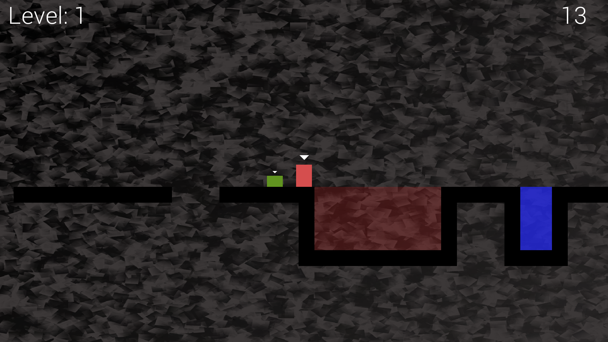

# ThomasWasLate-Cpp-Dev

Used OpenGL/SFML (Simple Fast Multimedia Library), advanced OOP (Object Oriented Programming) concepts, split-screen functionality, sound spatialization, custom levels, particle effects
to reach the destination within a limited time frame by helping each other to overcome obstacles like a fire pit or a water pit.

This is an individual project. Not an original idea (learned from c++ game programming 2 course on Linkedin Learning).

Instructions to play: 

  THOMAS (Red Character): 

  1.) Movement - A and D 

  2.) Jumping – W 

  BOB (Green Character): 

  1.) Movement – Left and Right Key 

  2.) Jumping – Up Key 

  To Toggle Split Screen Mode – Press E 

  Exit - Esc
  
  
